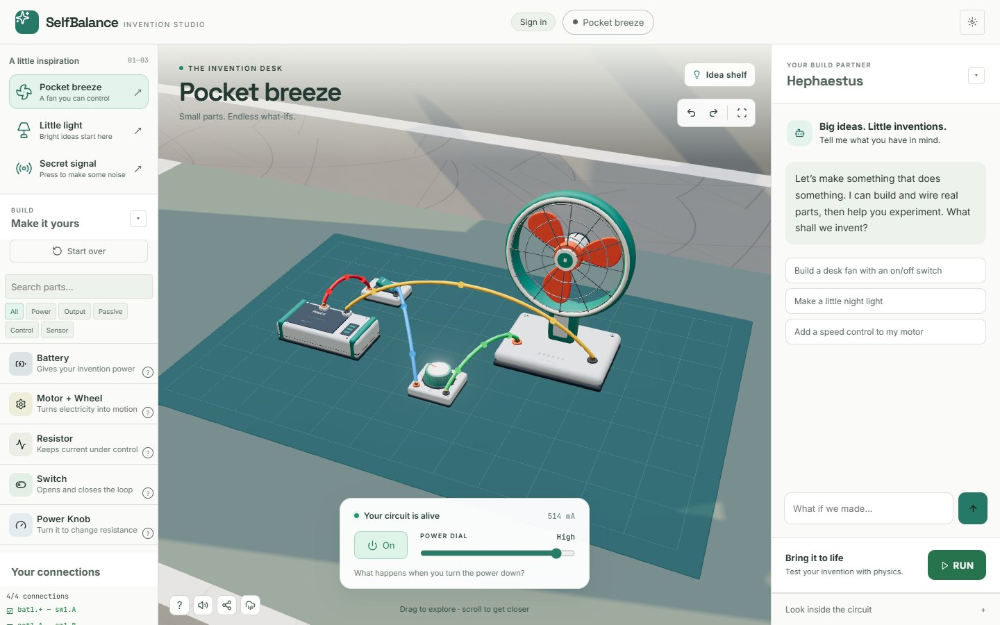

# SelfBalance — Invention Studio

SelfBalance is an AI invention studio for kids ages 10-14. Describe a
little invention, build it from electronic parts, and change it to see what
happens. The workbench combines a real steady-state DC circuit solver with a
3D bench and a motor physics test.

Live app: [selfbalance-lab.vercel.app](https://selfbalance-lab.vercel.app/)



## The studio

The catalog has 17 entries: 16 base component types plus the custom desk-fan
variant. Parts have real pins and electrical parameters, and the solver reports
branch current, LEDs, motor behavior, shorts, and over-current conditions as a
build changes.

The custom 3D kit includes a fan, battery, motor, lamp, and readable controls.
The starter shelf includes:

- **Pocket breeze** - a fan with a switch and power dial.
- **Little light** (`Light switch`) - a switch-controlled lamp.
- **Secret signal** (`Push-button buzzer`) - a momentary button that makes sound only while held.

Drag parts onto the bench, wire pin to pin, and edit values under **Look inside the circuit**. The Hephaestus assistant can place parts, lay them out, wire them,
rename the invention, toggle switches, and tune parameters through the same
validated tool API used by the interface. RUN keeps the actual creation and
couples its solved motor current to the motor physics; returning to the bench
continues the same build. Builds save locally and can be shared with a URL.
The phone shell provides the same workflow on a small touch screen.

## Honest limits

The solver is a steady-state DC model. It does not run general code, blinking
programs, transient or AC behavior, or airflow simulation. RUN tests motor
physics driven by the solved current; it is not a full robotics simulator.
Hephaestus needs the deployed Vercel proxy with an OpenRouter or Gemini key.
The static app and manual building work without that AI connection.

## Run locally

The app has no build step and loads its browser dependencies from the import map
in `index.html`:

```bash
npm install
npm run serve
```

Open the printed local URL in a browser with WebGL and WebAssembly. The local
server serves the static app; it does not provide the Vercel AI backend, so
Hephaestus requires a separately configured endpoint when running locally.

## Development and verification

```bash
npm test          # browser suite (62 checks in the current suite)
npm run test:mcp  # solver and tool suite (10 checks)
npm run lint
```

The single mutation and inspection authority is `window.__api`. The circuit
solver and document model are pure modules shared by the browser and the MCP
server, so both surfaces evaluate the same builds.

| Path | Purpose |
|---|---|
| `js/model/library.js` | 17-entry component catalog, pins, and defaults |
| `js/sim/circuit.js` | Modified Nodal Analysis DC solver |
| `js/api/index.js` | Document mutations and reads through `window.__api` |
| `js/app/creator-assembly.js` | 3D placement, wiring, bench physics, and live feedback |
| `js/app/invention-studio.js` | Kid-focused invention heading, controls, and experiment readout |
| `js/app/invention-models.js` | Custom 3D fan, battery, motor, lamp, and control models |
| `js/parts.js` | Reusable detailed battery and motor meshes |
| `js/sim/creator-sim.js` | RUN-mode motor physics driven by solved current |
| `js/app/hephaestus.js` | AI co-builder client loop |
| `js/app/mobile.js` | Phone shell and touch layout |
| `mcp/` | Browserless access to the same document and solver |
| `tests/` | Playwright browser verification |

The canonical repository is
[RaphaelKhalid/self-balance-lab](https://github.com/RaphaelKhalid/self-balance-lab).
